# Contributing Guidelines

Thanks for taking the time to contribute.

The following is a set of guidelines for contributing to VietFin. These are mostly guidelines, not rules.

## Code style

Guidance on code style

- Use [ruff](https://docs.astral.sh/ruff/) to format code following the [PEP 8](https://peps.python.org/pep-0008/) style guide, configured in `pyproject.toml`. For example:
    - Use 4 spaces per indentation level
    - Use `snake_case` for variable and function names
    - Use `PascalCase` for class names
    - Use `ALL_CAPS` for constants
    - Use double-quoted strings
    - Limit all lines to a maximum of 80 characters
- Use [numpy style docstrings](https://numpydoc.readthedocs.io/en/latest/format.html#docstring-standard)
- Use [Type Hints](https://peps.python.org/pep-0484/) for functions and classes

## Branch strategy

This project uses a two-layer branch model.

- `dev` is the main branch. All new features and bug fixes are made on this branch.
- `main` is the stable branch. This branch is updated only when a new release is made.


Credit: [yfinance](https://github.com/ranaroussi/yfinance/discussions/1084)

## Contributing to the codebase

### Work on an issue

Pick or suggest an issue, by going through the [issue tracker](https://github.com/vietfin/vietfin/issues), which you would like to work on. 

Setup your local development environment. Then start coding.

### Setup local development environment

We use the combination of [conda](https://docs.conda.io/en/latest/) to manage virtual environments and [poetry](https://python-poetry.org/) to manage dependencies.

- Clone the `dev` branch of the VietFin repository. E.g. `git clone -b dev https://github.com/h7b/vietfin.git`
- Install [conda](https://docs.conda.io/en/latest/miniconda.html)
- Create a new conda environment named `dev-vietfin` with `Python 3.10`. E.g. `conda create -n dev-vietfin python=3.10`
- Activate the environment. E.g. `conda activate dev-vietfin`
- Install poetry. E.g. `conda install poetry`
- Install dependencies with optional dependency group `dev` for developement purposes. E.g. `poetry install --with dev`

### Open a Pull Request

When you have resolved your issue, open a pull request (PR) in the VietFin repository. Please adhere to the following guidelines:

- Make sure your branch is up to date with the `dev` branch of VietFin repository
- Start your PR title with a [conventional commit](https://www.conventionalcommits.org/en/) tag. We use the [Angular convention](https://github.com/angular/angular/blob/22b96b9/CONTRIBUTING.md#type) and follow this [guideline for git commits](https://deepsource.com/blog/git-best-practices)
- In the PR description, link to the issue you were working on

### Git Process

- Ensure that your branch is up to date with the `dev` branch of VietFin repository. E.g. `git pull upstream dev`
- Create a new git branch for your feature. E.g. `git checkout -b feat/AmazingFeature`
- Check the files you have touched using `git status`
- Stage the files you want to commit. E.g. `git add src/vietfin/funds/funds.py`
- Write a concise commit message under 50 characters. E.g. `git commit -m "feat: add AmazingFeature"`
- Push your changes to the appropriate branch in your fork. E.g. `git push origin feat/AmazingFeature`
- Go to your [GitHub](https://github.com/), then open a PR in the VietFin repository

## Contributing to documentation

The documentation is written in [reStructuredText](https://docutils.sourceforge.io/rst.html) syntax, built with [Sphinx](https://www.sphinx-doc.org/en/master/) and [Shibuya](https://shibuya.lepture.com/) theme.

If you want to modify/add documentation and see how changes will be rendered, you can setup a local development virtual environment as follows.

- Clone the `dev` branch of the VietFin repository. E.g. `git clone -b dev https://github.com/h7b/vietfin.git`
- Install [conda](https://docs.conda.io/en/latest/miniconda.html)
- Create a new conda environment named `docs-vietfin` with `Python 3.10`. E.g. `conda create -n docs-vietfin python=3.10`
- Activate the environment. E.g. `conda activate docs-vietfin`
- Install poetry. E.g. `conda install poetry`
- Install dependencies with optional dependency group `docs` for writing docs purposes. E.g. `poetry install --with docs`

You can also suggest to edit a single page of the docs, simply by clicking the `Edit this page` button on the right side bar of the VietFin docs page. This will open a GitHub website where you can edit the single docs page and submit a PR to the VietFin repository.

## Test suite

The `./tests` folder contains the main VietFin test suite.

At the moment, the test suite contains only unit tests. These tests assert that all VietFin functionality work as intended with default parameters. Read the [Testing Guidelines](/tests/README.md) for more details.

## Versioning

VietFin adheres to the [semantic versioning](https://semver.org/) specification.

<!-- TODO: for future. If we decide to introduce a breaking change, the existing behavior will be deprecated. The deprecated functionality is removed two breaking releases after the deprecation happens. For example, a function deprecated in version `0.18.3` will be removed in version `0.20.0`. -->

## Codebase structure

At high level, the codebase is structured as 3 layers:

The 1st layer, "Facade", is a recreation of the [OpenBB's hierarchical structure](https://docs.openbb.co/platform/reference) for user-facing commands. It includes a "wrapper" class named `VietFin`, and its components (i.e. `Funds`, `Equity`, `EquityPrice`, etc.). The word "Facade" coming from [Facade Design Pattern](https://faun.pub/design-patterns-in-python-facade-pattern-4f495746301d).


The 2nd layer, "Factory", is an implementation of the data fetching from API providers. It includes the abstract interface (i.e. `IFunds`, `IEquity`, etc.), its real/concrete implementations for each data provider (i.e. `FundsFmarket`, `EquitySsi`, etc.) and the data models for each API provider (i.e. `FmarketFundInfoData`, `SsiEquitySearchData`, etc.). I applied the [Factory Design Pattern](https://realpython.com/factory-method-python/) to develop this layer. I expect that it should be coherent to add new features (e.g. more asset types, groups of commands) and to integrate new data providers.


The 3rd layer is "Data Standardization", an accomodation of various data structure, which is a fork of the OpenBB's [Data Standardization Infrastructure](https://docs.openbb.co/platform/development/developer-guidelines/architectural_considerations). It includes the abstract classes (i.e. `VfObject`, `Data`) and the data models for each API provider (i.e. `FmarketFundInfoData`, `SsiEquitySearchData`, etc.).


In combination of 3 layers, take an example with the component `Funds` of `VietFin` package.
- The logic of creating the `FundsFmarket` object is encapsulated in the `FundsFactory` abstract interface.
- The real/concrete implementation of the data fetching from provider Fmarket is in the `FundsFmarket` class.
- The data standardized model is the `FmarketFundInfoData` class and its peers, which is located in `/vietfin/providers/fmarket/models/`.

## Codebase Class Diagram

I followed the [six types of relationships in UML class diagrams](https://blog.visual-paradigm.com/what-are-the-six-types-of-relationships-in-uml-class-diagrams/) and [mermaid.js class diagrams syntax](https://mermaid.js.org/syntax/classDiagram.html) to create this class diagram. I expect that it gives a good bird-eye view of the codebase.

```mermaid
---
title: VietFin Class Diagram
---
classDiagram
    class IFunds
    <<interface>> IFunds
    IFunds : search()*
    IFunds : historical()*
    IFunds : holdings()*

    class IEquity {
        <<interface>>
        search()*
        profile()*
    }

    class IEquityPrice
    <<interface>> IEquityPrice
    IEquityPrice : historical()*
    IEquityPrice : quote()*

    class IEquityOwnership {
        <<interface>>
        insider_trading()*
        major_holders()*
        foreign_trading()*
        prop_trading()*
    }

    class IEquityCalendar {
        <<interface>>
        events()*
    }

    class IEquityFundamental {
        <<interface>>
        management()*
        ratios()*
        dividends()*
        income()*
        balance()*
        cash()*
        multiples()*
    }

    class IEquityDiscovery {
        <<interface>>
        active()*
        gainers()*
        losers()*
    }

    class IDerivativesFutures
    <<interface>> IDerivativesFutures
    IDerivativesFutures : historical()*
    IDerivativesFutures : quote()*

    class IEtf {
        <<interface>>
        historical()*
        search()*
    }

    class IIndex {
        <<interface>>
        search()*
        constituents()*
    }

    class IIndexPrice {
        <<interface>>
        historical()*
    }

    class INews {
        <<interface>>
        company()*
    }

    class FundsFmarket {
        +search()
        +historical()
        +holdings()
    }

    class EquitySsi
    EquitySsi : +search()

    class EquityWifeed
    EquityWifeed : +search()

    class EquityTcbs {
        +profile()
    }

    class EquityPriceDnse
    EquityPriceDnse : +historical()

    class EquityPriceTcbs {
        +historical()
        +quote()
    }

    class EquityPriceSsi {
        +historical()
        +quote()
    }

    class EquityOwnershipTcbs {
        +insider_trading()
        +major_holders()
    }

    class EquityCalendarTcbs {
        +events()
    }

    class EquityFundamentalTcbs {
        +management()
        +ratios()
        +dividends()
        +income()
        +balance()
        +cash()
        +multiples()      
    }

    class EquityDiscoverySsi {
        +active()
        +gainers()
        +losers()
    }

    class DerivativesFuturesTcbs
    DerivativesFuturesTcbs : +historical()

    class DerivativesFuturesVdsc
    DerivativesFuturesVdsc : +quote()

    class EtfTcbs {
        +historical()
    }

    class EtfDnse {
        +historical()
    }

    class EtfSsi {
        +search()
    }

    class IndexSsi {
        +search()
        +constituents()
    }

    class IndexPriceTcbs {
        +historical()
    }

    class IndexPriceDnse {
        +historical()
    }

    class NewsTcbs {
        +company()
    }

    class EquityOwnershipCafef {
        +foreign_trading()
        +prop_trading()
    }

    IFunds <|.. FundsFmarket
    IEquity <|.. EquitySsi
    IEquity <|.. EquityWifeed
    IEquity <|.. EquityTcbs
    IEquityPrice <|.. EquityPriceDnse
    IEquityPrice <|.. EquityPriceTcbs
    IEquityPrice <|.. EquityPriceSsi
    IEquityOwnership <|.. EquityOwnershipTcbs
    IEquityOwnership <|.. EquityOwnershipCafef
    IEquityCalendar <|.. EquityCalendarTcbs
    IEquityFundamental <|.. EquityFundamentalTcbs
    IEquityDiscovery <|.. EquityDiscoverySsi
    IDerivativesFutures <|.. DerivativesFuturesTcbs
    IDerivativesFutures <|.. DerivativesFuturesVdsc
    IEtf <|.. EtfTcbs
    IEtf <|.. EtfDnse
    IEtf <|.. EtfSsi
    IIndex <|.. IndexSsi
    IIndexPrice <|.. IndexPriceTcbs
    IIndexPrice <|.. IndexPriceDnse
    INews <|.. NewsTcbs

    class FundsFactory {
        +get_provider()
        +Dict funds_providers_implementations
    }

    class EquityFactory {
        +get_provider()
        +Dict equity_implementations
    }

    class EquityPriceFactory {
        +get_provider()
        +Dict equity_price_implementations
    }

    class EquityOwnershipFactory {
        +get_provider()
        +Dict equity_ownership_implementations
    }

    class EquityCalendarFactory {
        +get_provider()
        +Dict equity_calendar_implementations
    }

    class EquityFundamentalFactory {
        +get_provider()
        +Dict equity_fundamental_implementations
    }

    class EquityDiscoveryFactory {
        +get_provider()
        +Dict equity_discovery_implementations
    }

    class DerivativesFuturesFactory {
        +get_provider()
        +Dict derivatives_futures_implementations
    }

    class EtfFactory {
        +get_provider()
        +Dict etf_implementations
    }

    class IndexFactory {
        +get_provider()
        +Dict index_implementations
    }

    class IndexPriceFactory {
        +get_provider()
        +Dict index_price_implementations
    }

    class NewsFactory {
        +get_provider()
        +Dict news_provider_implementations
    }
    
    FundsFactory <-- IFunds
    EquityFactory <-- IEquity
    EquityPriceFactory <-- IEquityPrice
    EquityOwnershipFactory <-- IEquityOwnership
    EquityCalendarFactory <-- IEquityCalendar
    EquityFundamentalFactory <-- IEquityFundamental
    EquityDiscoveryFactory <-- IEquityDiscovery
    DerivativesFuturesFactory <-- IDerivativesFutures
    EtfFactory <-- IEtf
    IndexFactory <-- IIndex
    IndexPriceFactory <-- IIndexPrice
    NewsFactory <-- INews

    class Funds {
        +search()$
        +historical()$
        +holdings()$
    }

    class Equity {
        +search()$
        +profile()$
    }

    class EquityPrice {
        +historical()$
        +quote()$
    }

    class EquityFundamental {
        +management()$
        +ratios()$
        +dividends()$
        +income()$
        +balance()$
        +cash()$
        +multiples()$
    }

    class EquityOwnership {
        +insider_trading()$
        +major_holders()$
        +foreign_trading()$
        +prop_trading()$
    }

    class EquityCalendar
    EquityCalendar: +events()$

    class EquityDiscovery {
        +active()$
        +gainers()$
        +losers()$
    }

    class DerivativesFutures {
        +historical()$
        +quote()$
    }

    class Etf {
        +search()$
        +historical()$
    }

    class Index {
        +search()$
        +constituents()$
    }

    class IndexPrice
    IndexPrice: +historical()$

    class News
    News: +company()$

    Funds .. FundsFactory
    Equity .. EquityFactory
    EquityPrice .. EquityPriceFactory
    EquityFundamental .. EquityFundamentalFactory
    EquityOwnership  .. EquityOwnershipFactory
    EquityCalendar .. EquityCalendarFactory
    EquityFundamental .. EquityFundamentalFactory
    EquityDiscovery .. EquityDiscoveryFactory
    DerivativesFutures .. DerivativesFuturesFactory
    Etf .. EtfFactory
    Index .. IndexFactory
    IndexPrice .. IndexPriceFactory
    News .. NewsFactory

    VietFin <-- Funds
    VietFin <-- Equity
    VietFin <-- Derivatives
    VietFin <-- Etf
    VietFin <-- Index
    VietFin <-- News
    Equity <-- EquityPrice
    Equity <-- EquityFundamental
    Equity <-- EquityOwnership
    Equity <-- EquityCalendar
    Equity <-- EquityDiscovery
    Derivatives <-- DerivativesFutures
    Index <-- IndexPrice
```



Based on this codebase's structure, when I want to add a new asset type (e.g. Etf), I need to:
- Create a new abstract interface for the new asset type. E.g. `class IEtf` in `/abstract/interface.py`
- Create a new Factory class to represent the concrete implementation of the new asset type. E.g. `class EtfFactory` in `/abstract/factory.py`
- Create a new concrete implementation of the new asset type and its data provider. E.g. `class EtfSsi`in the appropriate `/providers/new_provider/provider.py`
- Create client code linked to the new Factory class. E.g. `class Etf` in `/components/etf.py`
- Initialize the new asset class in the `VietFin` class. E.g. `self.etf = Etf()` in `src/vietfin/__init__.py`

## Directory structure

```text
.
├── abstract                                    # abstract classes and interfaces
│   ├── __init__.py
│   ├── data.py                                 # Data class, the heart of Data Standardization layer of VietFin
│   ├── factory.py                              # Factory classes for each menu of commands
│   ├── interface.py                            # Abstract interfaces for each menu of commands
│   └── vfobject.py                             # VfObject class, every command will return this class as the command output.
├── components                                  # The 1st layer, “Facade” of the VietFin package
│   ├── __init__.py
│   ├── derivatives.py                          # Menu of commands related to Derivatives
│   └── ...
├── providers                                   # The functions and data model which crawl data from each data provider
│   ├── cafef                                   # Provider CafeF
│   │   ├── models                              # Data models used in the provider
│   │   │   ├── __init__.py
│   │   │   ├── equity_ownership_foreign.py
│   │   │   └── ...
│   │   ├── utils                               # Functions used to crawl data from the provider
│   │   │   ├── equity_ownership_foreign.py
│   │   │   ├── ...
│   │   │   └── helpers.py
│   │   ├── __init__.py
│   │   └── provider.py                         # The concrete implementation of the provider 
│   ├── dnse                                    # Provider DNSE
│   ├── fmarket                                 # Provider Fmarket
│   ├── ssi
│   ├── tcbs
│   ├── vdsc
│   ├── wifeed
│   └── __init__.py
├── utils                                       # Utility functions used in the package
│   ├── __init__.py
│   ├── errors.py                               # Custom exceptions
│   └── helpers.py                              # Utility functions
├── __init__.py
└── py.typed                                    # Dummy file to enable static type hints
```
